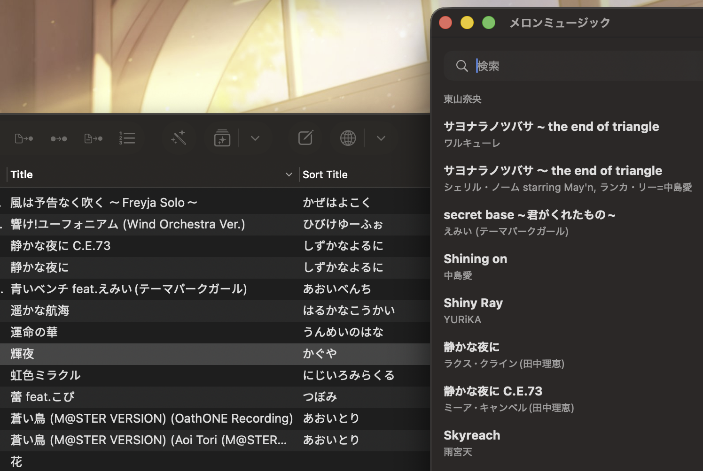

  
  
  

# Melon Music

**Melon Music** is an elegant, simple, beautiful, and free iPhone music player for local music libraries.

It is designed for people who keep their own music files, care about a clean playback experience, and want an app that does not turn into a Swiss Army knife of cloud logins, streaming services, equalizers, account systems, and nested menus.

Melon Music focuses on one thing: making a local music library feel pleasant, fast, and natural to use.

## A new playback layout

Melon Music removes the traditional progress bar and back button.

Instead, playback is centered around a persistent playlist. The previous and next songs are always visible, and you can move to them directly with a tap or swipe.

The goal is simple: you should always know what is playing, what comes next, and how to get there.

## Built for Japanese and Chinese music libraries

Melon Music pays special attention to mixed-language libraries and Japanes in particular.

The core issue is Japanese Kanji have no fixed pronounceation and therefore cannot be reliably sorted by a computer. One remedy is the sort field tag, where you can manually enter the pronounceation of Kanji names so they could be sorted correctly. However almost no existing software other than giants like Apple Music support this sort field.

Melon music supports sort fields for title, album and artist name (or album artist). The following screenshot demostrats what it does, without sort tags, 静か would just sort as a kanji somewhere at the very bottom among the other kanji in no sensible order. But with sort tag support, this song will be sorted with other し titles. Melon music has a toggle to fold し into S, which can be disabled should the user want to separate kana from English.

青瓜音乐也支持单纯的拼音排序，如果你给日语标题全部加上排序提示，再打开拼音排序，那么日语和中文的汉字即可同时被正确排列。你甚至可以关闭罗马字转换，这样所有的日文都会被归到假名部分，中文和英文则使用英文字母排序。

## Fast index navigation

Melon Music generates fast index labels for Title, Artist, and Album views.

The side index is based on the actual contents of your library. It can surface the letters or characters that appear most often, making large mixed-language libraries much easier to navigate.

Instead of forcing every library into a fixed A–Z index, Melon Music creates a small map of the library you actually have.

## Folder exclusion without moving files

Melon Music uses a visible local folder that can be accessed from the iOS Files app.

You can organize music however you want, and Melon Music will not modify your files.

First-level folders can be excluded or re-enabled instantly. This makes it easy to keep separate libraries, such as:

- Pop
- Classical
- Anime
- Soundtracks
- Podcasts
- Test files
- Large archives

Excluding a folder does not require rebuilding the whole database, moving files, or destroying existing playlists.

## Customization

Melon Music is designed to look good with a clean flat background by default.

For users who want a more personal look, it also supports:

- custom background images
- accent colors
- light and dark appearance
- color suggestions from the selected background image
- simple hue and brightness controls instead of raw RGB sliders

The goal is customization without turning the app into a design assignment.

## Design philosophy

Melon Music is not trying to be the most feature-packed music player.

It is trying to be a better-shaped tool.

A lot of music apps add features like a collector’s Swiss Army knife: every request becomes another blade, another tab, another settings page, another context menu. Eventually the app becomes wider than it is long.

Melon Music is built around restraint:

It is a local music player for people who want their music library to feel simple again.

## Major features

- Local music playback from files stored on device
- Visible Files app folder
- Persistent temporary playlist
- No traditional progress bar
- No ambiguous back button
- Tap or swipe to access neighboring songs
- Frictionless Mix creation
- Combine saved Mixes easily
- Sort by Title, Artist, Album Artist, Genre, and Album
- Optional romaji sorting for Japanese kana
- Optional pinyin sorting for Chinese names and titles
- Support for embedded sort tags
- Fast index labels for Title, Artist, and Album
- Folder exclusion without moving files
- Search by filename, path, and metadata
- Custom background image
- Accent color customization
- Light and dark appearance
- Small app size and low memory usage

## Status

Melon Music is waiting for Apple AppStore approval.
